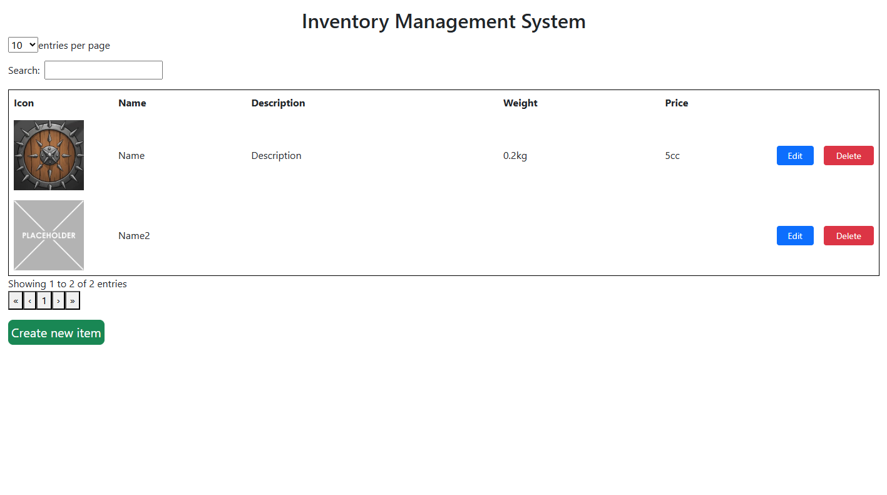
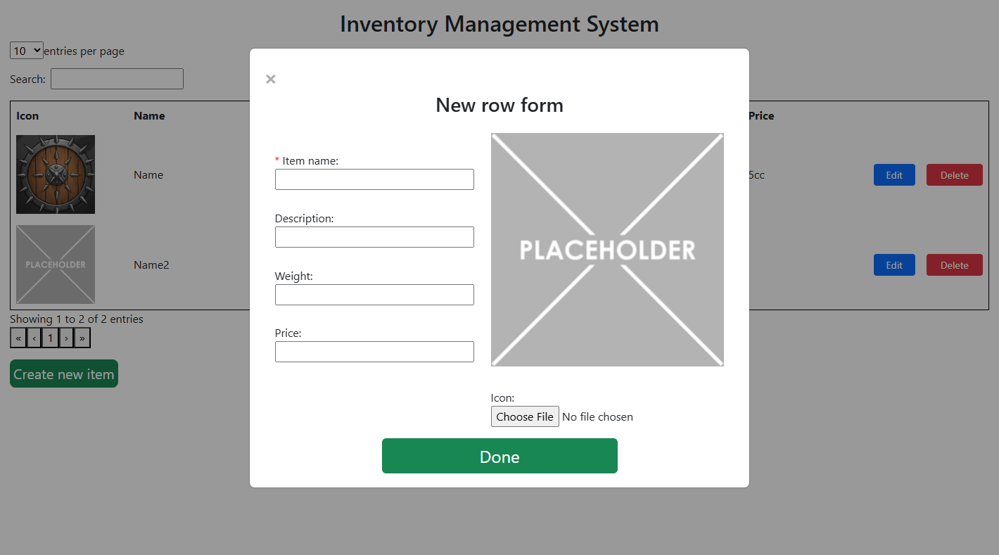
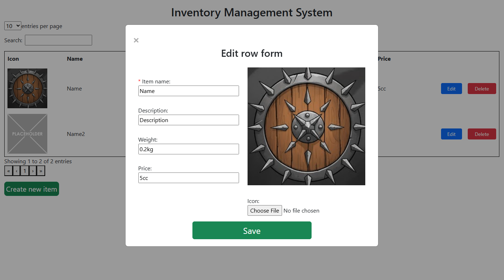
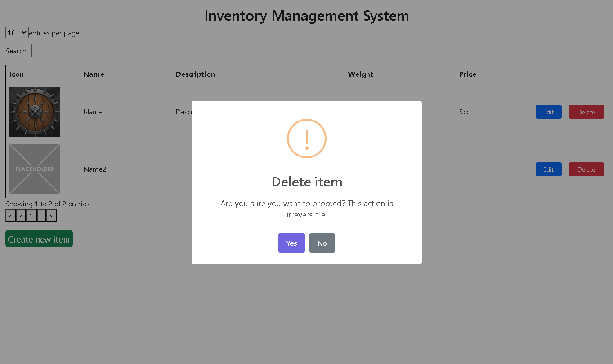

# Inventory Management System Site

This project uses Python Flask backend and vanilla JavaScript frontend with DataTables to add, edit and remove items from the inventory table.









## Functionality
- Adding a new item by filling out form inputs, name is the only required field, and image upload is available
- Editing an existing item including an image
- Deleting an item from the table and the API

## Requirements
1. Python **3.14+**
2. Node.js **24.16+**
3. npm **11.16.0**

## Installation

1. After cloning this project on your machine you will need to open a directory with the project root in your terminal using `cd C:/repository-path`

2. After that you need to open a backend folder using `cd backend`

3. Create a virtual environment `py -m venv ./venv` for Windows or `python3 -m venv venv` for Linux / macOS

4. And activate a virtual environment:

*Windows*:
- PowerShell: `.\venv\Scripts\Activate.ps1`
- Command Prompt (CMD): `.\venv\Scripts\activate.bat`
- Git Bash / MinGW: `source venv/Scripts/activate`

*macOS / Linux*
- Bash / Zsh: `source venv/bin/activate`
- Fish Shell: `source venv/bin/activate.fish`
- C Shell (csh): `source venv/bin/activate.csh`

5. Then install the requirements from the requirements.txt file `pip install -r requirements.txt`

6. And run the backend app `py inventory_app.py` for Windows or `python3 inventory_app.py` for Linux / macOS
    - API runs on the <http://127.0.0.1:5000/inventory>

7. Now open another terminal and open frontend folder `cd frontend`

8. Install frontend requirements `npm i`

9. And run the frontend `npm run dev`

10. Now open <http://localhost:5173> in your browser

If you did everything correctly right now you should see a table with 2 default-placeholder items and be able to edit, delete them or create a new one

## Project Structure
```
Root
├── backend
│   ├── inventory_app.py        # Flask backend
│   └── requirements.txt        # Backend requirements
└── frontend
    ├── index.html              # Main page
    └── src
        ├── main.js             # Frontend logic
        └── css                 
            └── styles.css      # Styling
```

## License
This project is licensed under the MIT License. See the [LICENSE](LICENSE) file for details.

## Contact Information
**Email**: <workmail.radionov@gmail.com>

**LinkedIn**: <https://www.linkedin.com/in/oleksandr-radionov-54b289376>

**Discord**: syn_gabena
